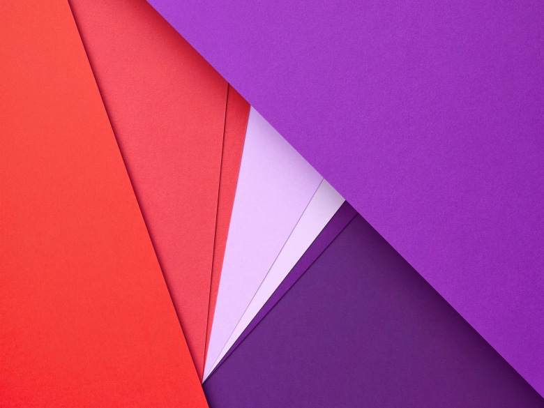

<small>Above: An image promoting Google's new "Material" design metaphor 
Image Credit: Google</small>

# Material Design Color Palette

Sketch 3 plugin generate a palette of Google material design color for you.

## Shortcuts

+ Hue - __⌃⇧H__ ( Control + Shift + H )
+ Value - __⌃⇧V__ ( Control + Shift + V )

## Resource

+ [Color - Style - Google design guidelines](http://www.google.com/design/spec/style/color.html#color-color-palette)