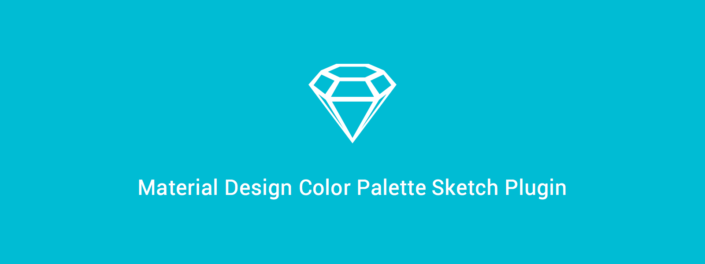
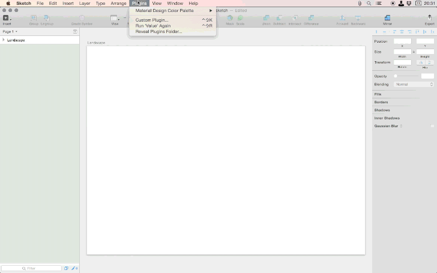

> Sketch 3 plugin generate a palette of Google material design color for you.

## Demo

## Shortcuts
+ Hue - __⌃⇧H__ ( Control + Shift + H )
+ Value - __⌃⇧V__ ( Control + Shift + V )
+ Swatch - __⌃⇧S__ ( Control + Shift + S )

## Installation

+ Add Material Design Color Palette folder to the plugin folder `/Library/Application Support/com.bohemiancoding.sketch3` or `~/Library/Containers/com.bohemiancoding.sketch3/Data/Library/Application Support/com.bohemiancoding.sketch3/` or find it via menu option in Sketch 3 Plugins / __Reveal Plugins folder...__
+ Or you can find this plugin on [Sketch Toolbox.app](http://sketchtoolbox.com/), so you just search and download it.

## Resource
+ [Color - Style - Google design guidelines](http://www.google.com/design/spec/style/color.html#color-color-palette)